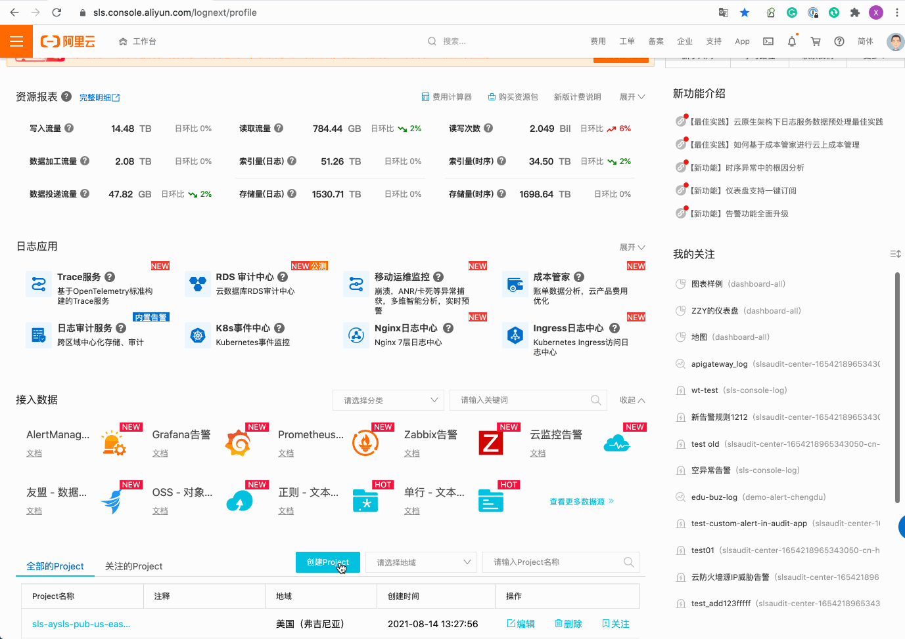
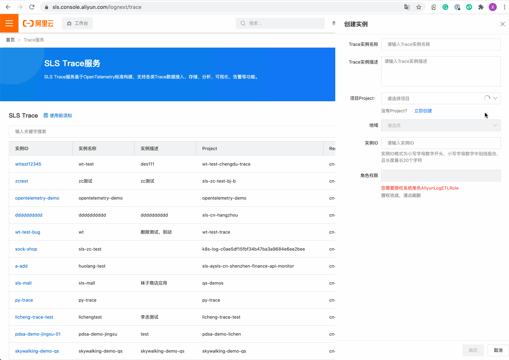
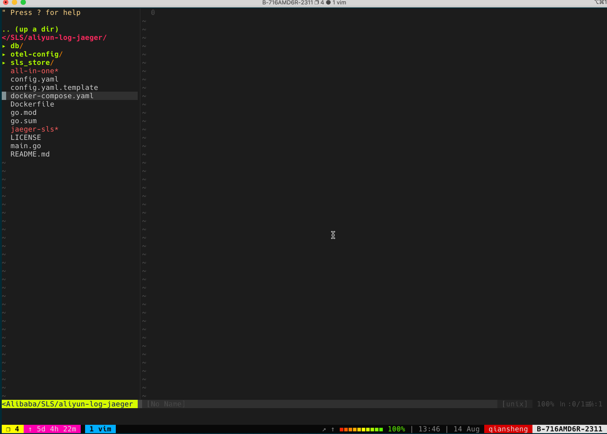
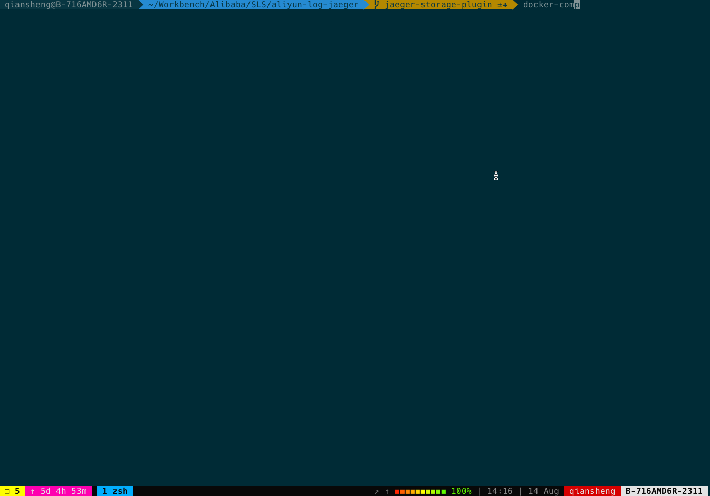
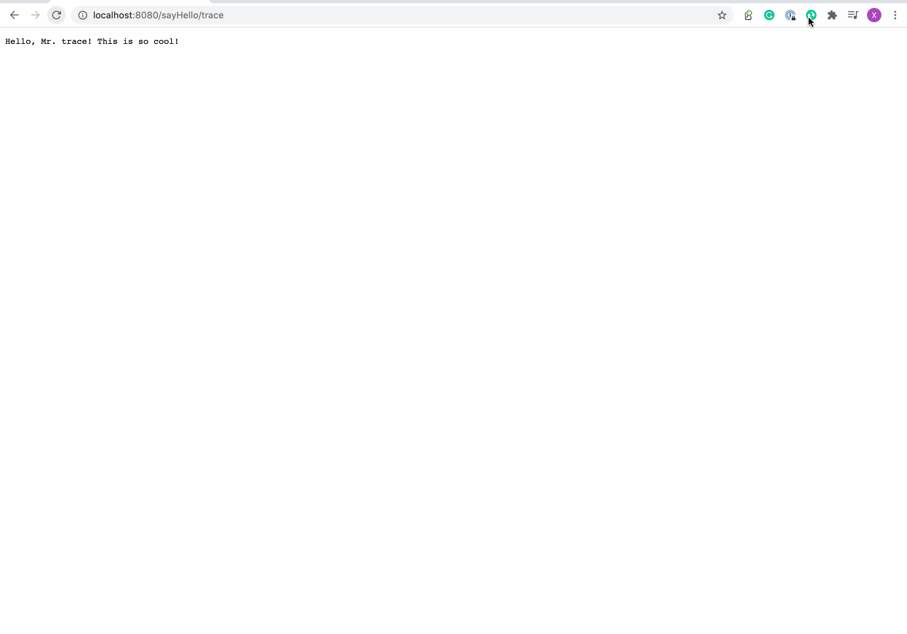

# SLS Storage Plugin

This is the repository that contains object storage (Alibaba Could log service) plugin for Jaeger.

## About

As a component of an observability/monitoring system, Jaeger is an essential source of data for development and
operations students to locate and find problems and exceptions with the business system. As an SRE, we must ensure that
the monitoring system lives longer than the system. Once the monitoring system is down before the business system,
monitoring is entirely worthless. Monitoring is the last barrier for business exception analysis, and it is more
sensitive to high availability and high performance than other systems.

The [Alibaba Could log service](https://www.alibabacloud.com/product/log-service)(SLS) provides high performance,
resilience, and freedom from operation and maintenance, allowing users to cope with surge traffic or inaccurate size
assessment quickly, and the SLS service itself provides 99.9% availability and 11 out of 9 data reliability.

The Alibab Cloud log service  :heart:  Jaeger

## Quick Start

1. Login [Alibaba Cloud log service Console](https://sls.console.aliyun.com/lognext/profile)
2. Create Project
   
3. Create Trace Instance
   
4. Modify Docker compose file
   
5. Start Demo
   
6. Having fun with Jaeger and SLS.    :grinning:
   

## Build/Compile

In order to compile the plugin from source code you can use `go build`:

```shell
cd /path/to/jaeger-sls
go build
```

## Start

Executing the following command to start jaeger with Tenon Plugin
```shell
export ACCESS_KEY_SECRET: ""
export ACCESS_KEY_ID: ""
export PROJECT: ""
export ENDPOINT: ""
export INSTANCE: ""
GRPC_STORAGE_PLUGIN_BINARY="./jaeger-sls" GRPC_STORAGE_PLUGIN_CONFIGURATION_FILE=./config.yaml SPAN_STORAGE_TYPE=grpc-plugin JAEGER_DISABLED=true GRPC_STORAGE_PLUGIN_LOG_LEVEL=DEBUG ./all-in-one
```

## License

The SLS Storage gRPC Plugin for Jaeger is an [MIT licensed](LICENSE) open source project.
